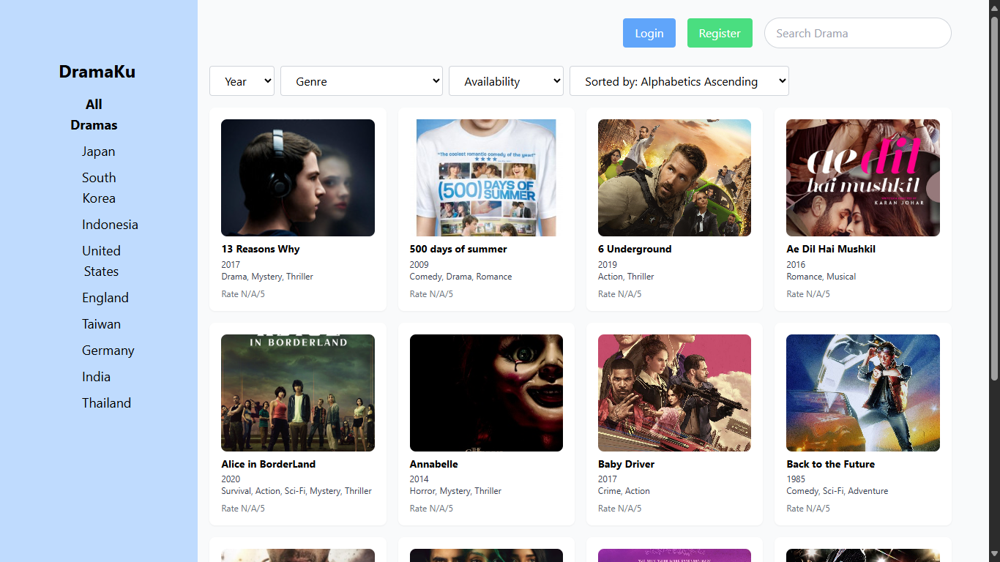

<div align="center">
  
</div>


# Aplikasi DramaKu

DramaKu adalah aplikasi manajemen film berbasis web yang menyediakan informasi lengkap tentang berbagai drama, termasuk genre, negara, tahun rilis, platform tayang, dan detail lainnya. Pengguna dapat menjelajahi detail informasi setiap drama, memberikan komentar, serta menambahkan drama favorit atau yang akan ditonton ke dalam watchlist (dengan login terlebih dahulu). Aplikasi ini juga dilengkapi fitur pengelolaan data oleh administrator, seperti menampilkan, menambah, mengedit, dan menghapus data terkait drama, genre, negara, aktor, award, dan pengguna.


# Features

- Landing Page
- Detail Page
- Watchlist
- CMS
- Authentication (Login & Register)


# Tech Stack

**Frontend:** React, TailwindCSS

**Backend:** Node.js, Express.js, Google OAuth, JSONWebToken, Bcrypt

**Database:** PostgreSQL

**Testing:** JEST

**Deployment:** Docker


# Installation
    
## Run Locally

### Setting Up Frontend

**Clone the project**

Tentukan terlebih dahulu di folder mana anda akan menyimpan project, lalu jalankan perintah berikut

```bash
  git clone https://github.com/hanswryy/myweb-app.git
```

**Go to the client directory**

```bash
  cd myweb-app/client
```

**Install dependencies**

Jalankan perintah berikut untuk menginstall semua dependencies yang dibutuhkan frontend (client)

```bash
  npm install
```

### Setting Up Backend

**Go to the server directory**

```bash
  cd ../server
```

**Install dependencies**

Jalankan perintah berikut untuk menginstall semua dependencies yang dibutuhkan backend (server)

```bash
  npm install
```

### Running

**Frontend (client)**

```bash
  npm start
```

**Backend (server)**

```bash
  npm start
```
## Run Locally with Docker

Clone the project

```bash
  https://github.com/hanswryy/myweb-app.git
```

Go to the project directory

```bash
  cd myweb-app
```

Run docker compose

```bash
  docker-compose up -d
```

Go see localhost:3000

## Default Admin Credentials

Setelah setting up aplikasi, masuk sebagai administrator menggunakan kredensial berikut:

**Username:** admin  
**Password:** secretAdminP@ss123  

# Demo

Insert gif or link to demo


# Contributors

- Asri Husnul Rosadi - 221524035 
- Farhan Muhammad Luthfi - 221524039
